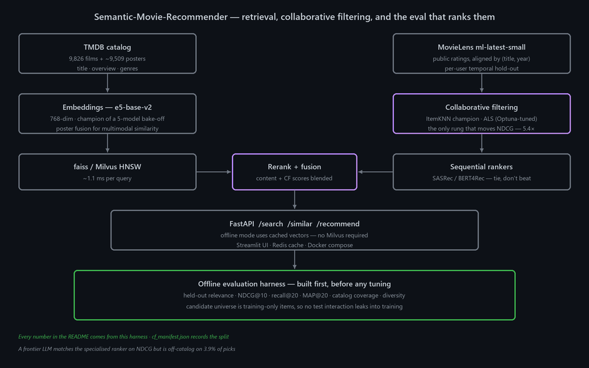

> 🔗 **Live demo:** https://iambatman07-semantic-movie-recommender.hf.space · [HF Space](https://huggingface.co/spaces/IamBatman07/Semantic-Movie-Recommender)

# Semantic-Movie-Recommender

A movie recommendation service over a 9,826-film TMDB catalog with posters. It does semantic search ("space adventure with robots"), item-to-item similarity ("more like Toy Story"), and personalized recommendations from a list of films you liked — served through a Streamlit UI and a FastAPI service backed by faiss or Milvus HNSW.

The project's spine is its offline evaluation harness, which was built **before** any tuning. Every claim below is a number that harness produced on a held-out split, including the ones that show a component didn't help.

---

## Architecture



---

## Measured results

### Only collaborative filtering actually moves the needle

Capability ablation on the personalized split (temporal leave-last-20% per user):

| Rung | System | NDCG@10 | recall@20 |
|---|---|---:|---:|
| 1 | semantic search (MiniLM centroid) | 0.0123 | 0.0243 |
| 2 | + better embeddings (e5-base-v2) | 0.0196 | 0.0399 |
| 3 | **+ collaborative filtering (ItemKNN)** | **0.1059** | **0.1675** |
| 4 | + tuning (ALS, Optuna) | 0.1058 | 0.1763 |
| 5 | + sequential ranker (BERT4Rec) | 0.0933 | 0.1688 |
| 6 | + diversity (ItemKNN + MMR) | 0.1017 | 0.1659 |

**CF is the only rung that changes the outcome — 0.0196 → 0.1059, a 5.4× lift.** Better embeddings gave +0.007. Tuning gave nothing on NDCG. The sequential transformer *lost* 0.013. Every rung after CF is flat or negative, and all six are reported.

Source: [`results/phase6_metrics.json`](results/phase6_metrics.json) · [`results/leaderboard.csv`](results/leaderboard.csv)

### Embedding bake-off — five models, marginal spread

1,072 held-out queries against the 9,837-item catalog:

| Model | dim | NDCG@10 | recall@20 | ms/query | encode time |
|---|---:|---:|---:|---:|---:|
| **e5-base-v2 (champion)** | 768 | **0.0482** | 0.0205 | 1.10 | 486 s |
| all-mpnet-base-v2 | 768 | 0.0480 | 0.0218 | 1.01 | 469 s |
| bge-base-en-v1.5 | 768 | 0.0393 | 0.0166 | 1.52 | 476 s |
| bge-small-en-v1.5 | 384 | 0.0376 | 0.0153 | 0.70 | 137 s |
| MiniLM-L6-v2 (originally shipped) | 384 | 0.0295 | 0.0109 | 0.71 | 72 s |

The champion is 1.6× better than the shipped model but takes 6.8× longer to encode the catalog — and the whole spread is small next to what CF delivers.

Source: [`results/phase2a_embeddings.csv`](results/phase2a_embeddings.csv)

### A frontier LLM matches the ranker but can't be served

30-user deterministic sample (seed 42), same temporal protocol:

| System | NDCG@10 | recall@20 | Off-catalog | Latency | Cost/query |
|---|---:|---:|---:|---:|---:|
| ItemKNN (specialised) | 0.0889 | 0.1040 | **0.0%** | **0.4 ms** | **$0** |
| Claude Opus 4.8, zero-shot | **0.0905** | **0.1439** | **3.9%** | 2,100 ms | $0.02295 |
| Popularity (reference) | 0.0488 | 0.0735 | 0.0% | 0.01 ms | $0 |

The LLM edges the ranker on NDCG — and then recommends films that aren't in the catalog. Of 360 recommendations, **14 were off-catalog**: 12 genuinely absent titles, 2 title variants. It is also ~5,200× slower.

That grounding failure is structural: a CF model can only ever return items that exist. Source: [`results/phase6_metrics.json`](results/phase6_metrics.json)

---

## How it works

1. **Align the data** — MovieLens ratings are matched to the TMDB catalog by (title, year). Only public data is used.
2. **Split per user, temporally** — the last 20% of each user's interactions is held out. The candidate universe is training-only items, so no test interaction can leak in. The split is recorded in `cf_manifest.json`.
3. **Embed the catalog** with e5-base-v2; posters are embedded too for multimodal similarity.
4. **Index** into faiss or Milvus HNSW for ~1 ms retrieval.
5. **Model users** with ItemKNN collaborative filtering — the component that actually produces personalization.
6. **Rerank and fuse** content and CF scores.
7. **Serve** through FastAPI, with a cached-vector offline mode so the Space runs without Milvus.
8. **Score everything** through the harness, on the same held-out split, every time.

## Infrastructure

| Layer | Technology |
|---|---|
| Embeddings | sentence-transformers (e5-base-v2) |
| Vector search | faiss HNSW · Milvus |
| Recommenders | ItemKNN · ALS (implicit) · SASRec / BERT4Rec |
| Tuning | Optuna |
| API | FastAPI — `/search` `/similar` `/recommend` |
| UI | Streamlit |
| Cache | Redis |
| Packaging | Docker · docker-compose |

---

## Quickstart

```bash
pip install -r requirements.txt          # Streamlit app deps
pip install -r requirements-api.txt      # FastAPI service deps

# 1. Streamlit UI (Discover / Search / Visual / For-You)
streamlit run pages/movieflix.py

# 2. FastAPI inference service (offline — no Milvus required; uses cached vectors)
uvicorn api:app --port 8000
#   POST /search    {"query": "space adventure with robots", "top_k": 5}
#   POST /similar   {"title": "Toy Story", "top_k": 5, "poster_fusion": true}
#   POST /recommend {"liked_titles": ["Toy Story", "The Lion King"], "top_k": 5}

# 3. Full stack (FastAPI + Milvus + Redis)
docker-compose up -d
```

Reproduce the evaluation:

```bash
python -m src.eval.build_eval            # build held-out relevance + CF split
python -m src.eval.baseline
python -m src.recsys.cf_compare
python -m src.eval.ablation
```

Regenerate the architecture diagram with `python assets/make_architecture.py`.

---

## Data

- **Catalog:** `data/9000plus.csv` (9,826 TMDB films) + `posters/` (~9,509 images).
- **Interactions:** public MovieLens ml-latest-small, aligned by (title, year).
- **Splits:** per-user temporal hold-out; candidate universe is training-only items.
- Cached embeddings live in `results/emb_cache/` so the API and eval share one encode.

---

## License
MIT — see [LICENSE](LICENSE).
